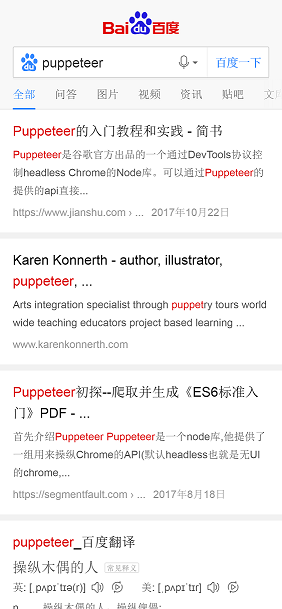

#node-puppeteer

###基于nodejs的`Puppeteer`网页爬虫

##介绍
`Puppeteer` 是谷歌官方出品的一个通过 `DevTools` 协议控制 `headless Chrome` 的 `Node` 库。可以通过 `Puppeteer` 的提供的 `api` 直接控制Chrome模拟大部分用户操作来进行UI Test或者作为爬虫访问页面来收集数据。它最大的特点就是它的操作 `Dom` 可以完全在内存中进行模拟既在V8引擎中处理而不打开浏览器

##主要功能
- 网页爬虫（仿真模拟用户操作）
- 利用网页生成PDF、图片
- 爬取SPA应用，并生成预渲染内容（即“SSR” 服务端渲染）
- 自动化表单提交、UI测试、键盘输入等
- 帮你创建一个最新的自动化测试环境（chrome），可以直接在此运行测试用例
- 捕获站点的时间线，以便追踪你的网站，帮助分析网站性能问题

##环境和安装
`Puppeteer` 本身依赖6.4以上的 `Node`，但是为了异步超级好用的 `async/await`，推荐使用7.6版本以上的 `Node`。另外 `headless Chrome` 本身对服务器依赖的库的版本要求比较高，`centos` 服务器依赖偏稳定，v6很难使用 `headless Chrome`，提升依赖版本可能出现各种服务器问题（包括且不限于无法使用 `ssh` ），最好使用高版本服务器。

##开始安装

> npm install

*如果安装报错请切换淘宝镜像 `cnpm` 安装即可*

##开始使用
> node index

##使用技巧
- **打开百度，并保存截图**

- **iPhoneX模式打开百度，并保存截图**

- **iPhoneX模式打开百度，搜索puppeteer关键字，跳转到查询结果页面后，保存截图**

###更多功能请查看 [官方API](https://zhaoqize.github.io/puppeteer-api-zh_CN/#/class-Puppeteer)